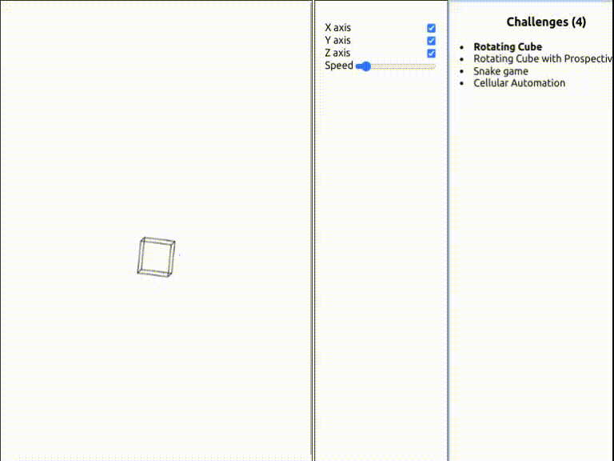

# Challenges

React application where I try to solve interested me programming challenges.
Primary source of ideas is [The Coding Train](https://www.youtube.com/@TheCodingTrain) YouTube channel.


## Installation and run
1. Install packages
```shell
npm i
```
2. Run application
```shell
npm run start
```
3. Open it in [browser](http://localhost:3000)
